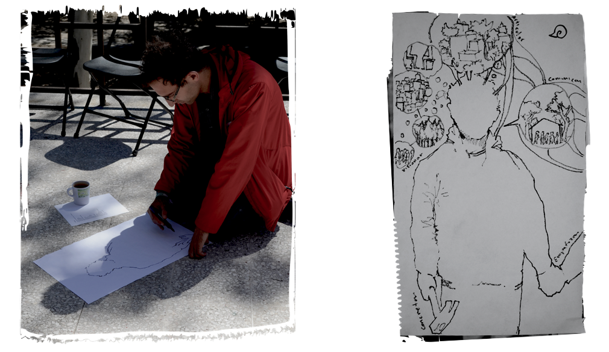

In our T-Lab project, participants created avatars (e.g., a fantastic animal, a plant, a person, which they illustrated on large sheets of paper and named) based on a set of given and self-identified attributes and capacities (powers).

We devised the avatars concept for three main reasons: 
1. The avatar is a proxy of an agent, and hence represents the agent, but is not the agent per se; it can embody different powers and these can change along the process; 
2. Even if powers have their own meaning as part of an avatar, these acquire more relevance when avatars build synergies with the powers of others; and 
3. When avatars interact, they can come to recognize that they possess other powers that they didn’t know that they had at the beginning of the process.

For more details on this and other tools created and adapted throughout our project:

[The Transformation Laboratory of the social-ecological system of Xochimilco, Mexico City: Description of the process and methodological guide](https://steps-centre.org/wp-content/uploads/2019/09/Guide-T-Lab-Xochi-screen-version-English-NA-Hub.pdf)

