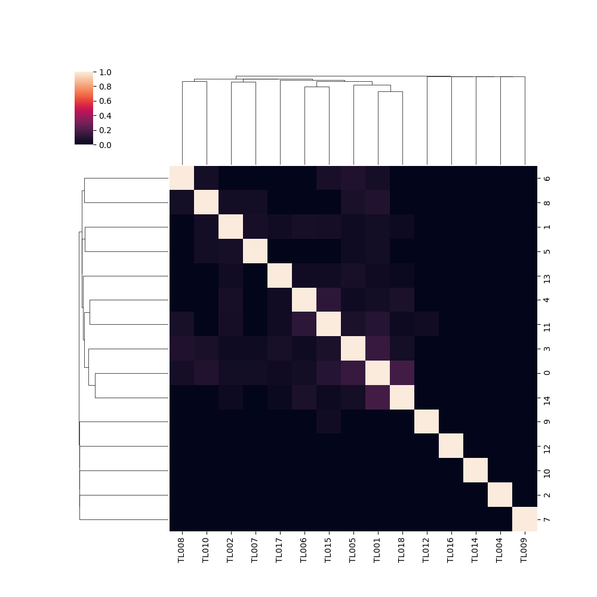

# Tlabs

## Hiveplot

### Colores de Egos y Alters

 - Academia: azul
 - Gobierno: verde
 - Otros: morado
 - Privado: morado
 - Sociedad_Civil: amarillo

Cuadros rojos son acciones, van ordenadas hacia afuera por in_degree.

### Vínculos

Los ejes 1 y 2 se conectan por curvas del color de los nodos del eje
2, el grosor representa la distancia.

Los ejes 2 y 3 se unen por vínculos color azul claro cuando el
in_degree de la acción es 1, y dark cyan cuando es mayor.

<table>
<thead>
<tr>
<td>
Gobierno
</td>
<td>
Academia
</td>
<td>
Otros.png
</td>
<td>
Privado
</td>
<td>
Sociedad Civil
</td>
</tr>
</thead>
<tbody>
<tr>
<td>

</td>
<td>

</td>
<td>

</td>
<td>

</td>
<td>

</td>
</tr>
</tbody>
</table>

# Clusterizados por sus alters

