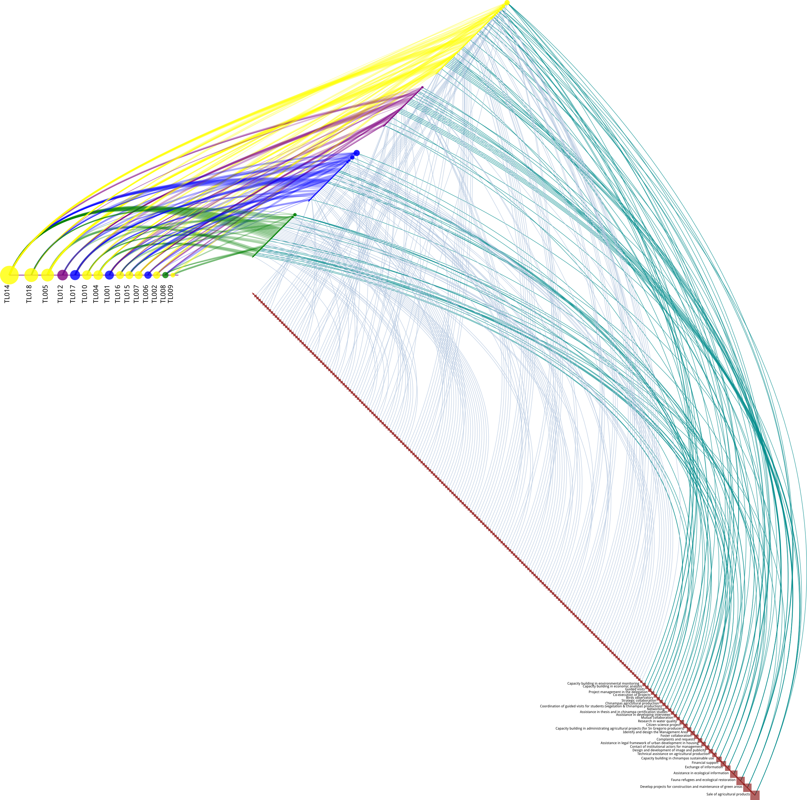
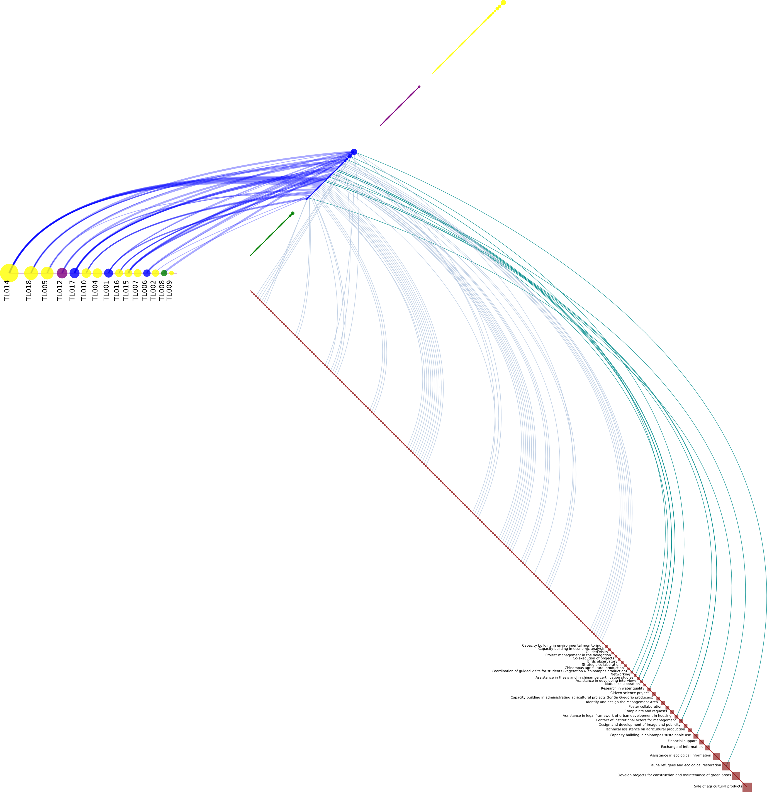
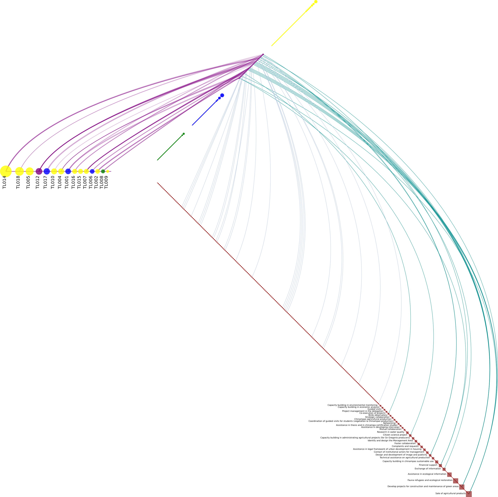
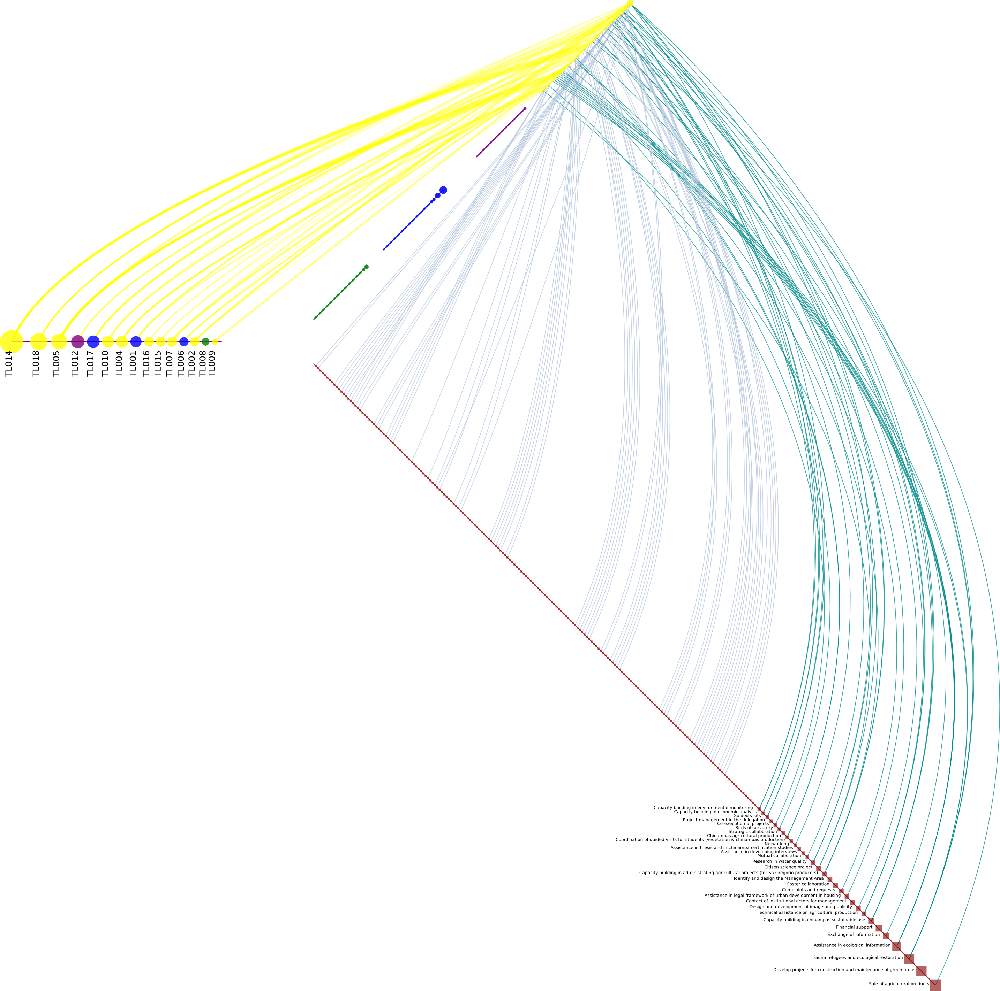
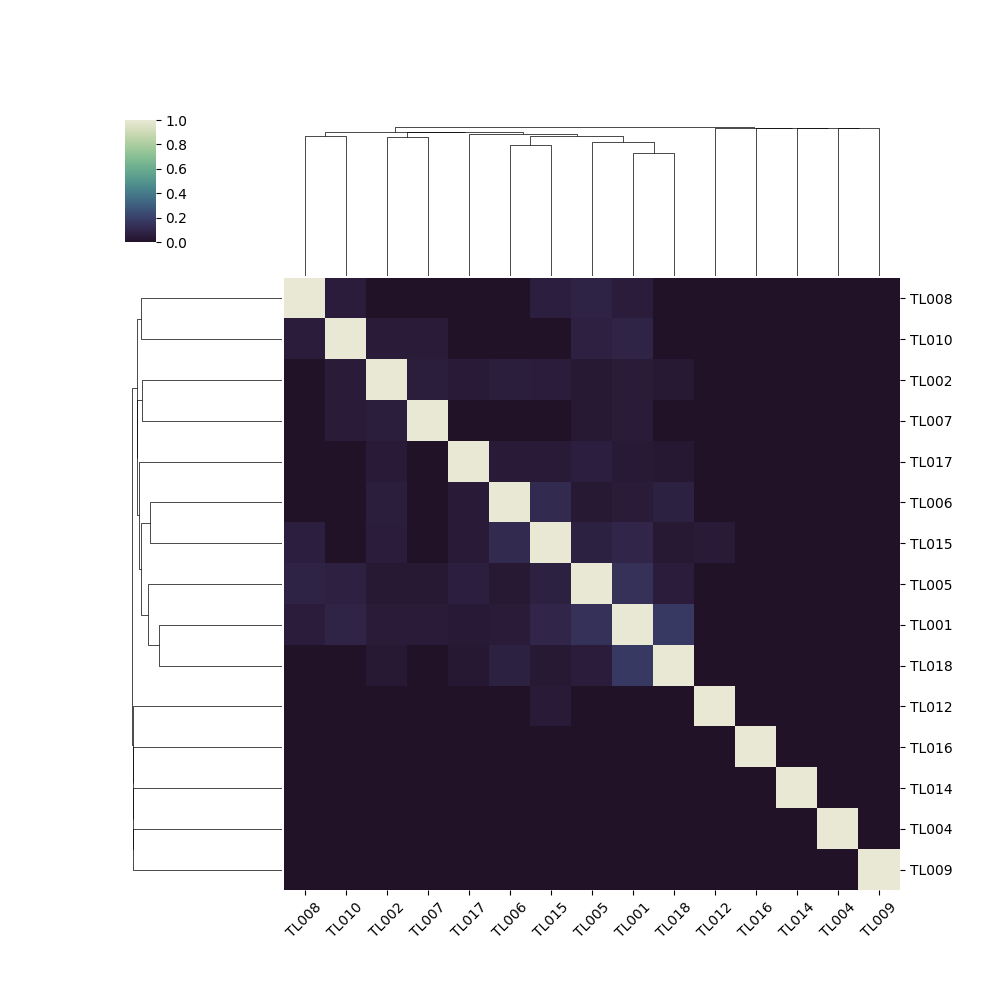
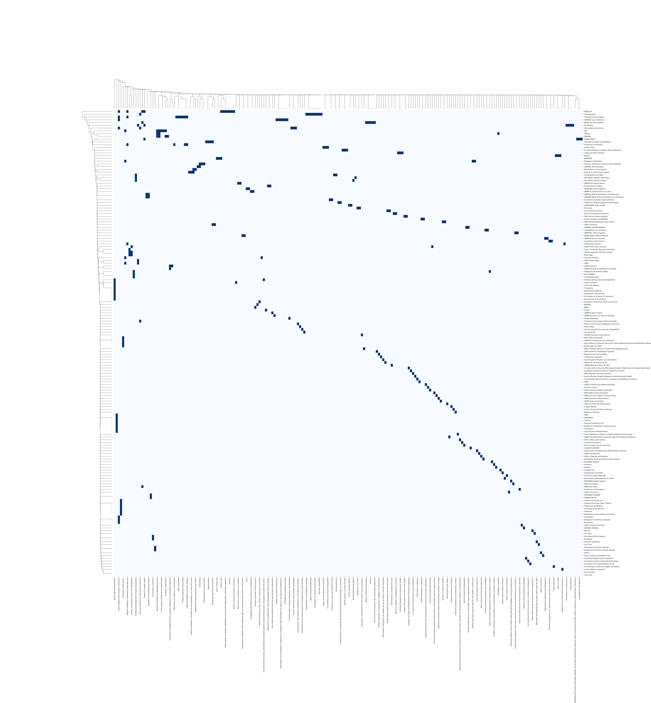

# Tlabs

## Hiveplots

1st axis: Egos (Colors by sector - Civil Society: yellow; Academia: blue; Government: green; Private sector: purple).

2nd axis: Alters (same colors by sector).

3rd axis: Practices (in red) ordered by Indegree.

2nd and 3rd axis are linked by practices (light cyan when the indegree is 1 and dark cyan when more).

<table>
<thead>
<tr>
<td>
Government
</td>
<td>
Academia
</td>
<td>
Private sector
</td>
<td>
Civil Society
</td>
</tr>
</thead>
<tbody>
<tr>
<td>

</td>
<td>

</td>
<td>

</td>
<td>

</td>
</tr>
</tbody>
</table>

## Clustered Egos by the Alters they share

Each cell in the heatmap contains the jaccard index of similarity
between both Egos' set of Alters.

## Clustered Egos by the practices they share

Each cell contains the jaccard index of similarity between both Egos'
set of Practices, which are indirectly joined to an Ego by her Alters.

## Clustered alters by their distances to Egos

## Alters, Practices clustered by mutual connections

