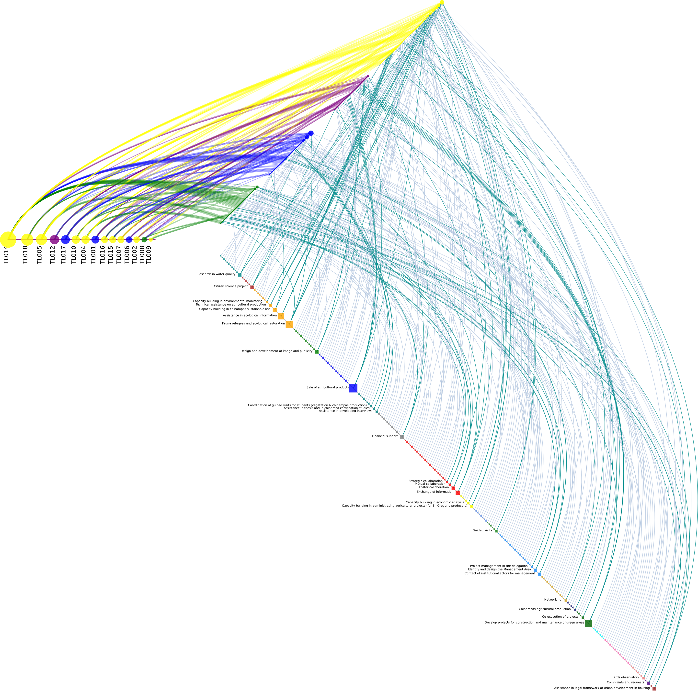
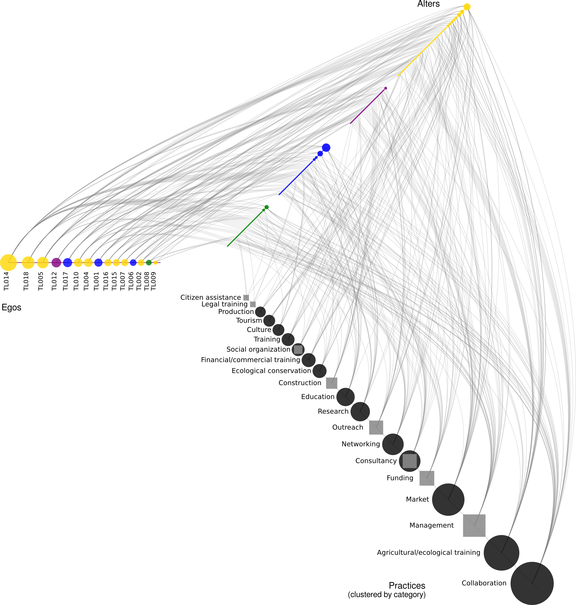
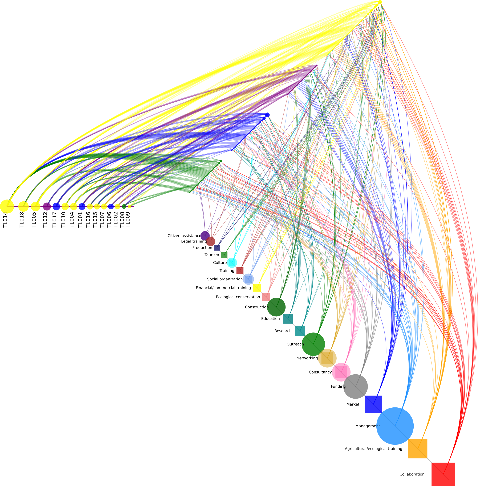

# Tlabs

## Hiveplots

1st axis: Egos (Colors by sector - Civil Society: yellow; Academia: blue; Government: green; Private sector: purple).

2nd axis: Alters (same colors by sector).

3rd axis: Practices (in red) ordered by Indegree.

2nd and 3rd axis are linked by practices (light cyan when the indegree is 1 and dark cyan when more).

Actions follow the following order and color scheme:

Practice | Category
---------|----------
Research | darkcyan
Training | firebrick
Agricultural/ecological training | orange
Outreach | green
Market | blue
Education | teal
Funding | grey
Collaboration | red
Financial/commercial training | yellow
Social organization | cornflowerblue
Tourism | forestgreen
Management | dodgerblue
Networking | goldenrod
Production | midnightblue
Construction | darkgreen
Culture | cyan
Consultancy | hotpink
Ecological conservation | lightcoral
Citizen assistance | indigo
Legal training | brown

### Practices grouped by category

Square nodes are categories in the **Urban** meta-category, circles are in the **Agro** meta-category.

Here is the [full list of practices](data/practices.csv).

## Clustered Egos by the Alters they share

Each cell in the heatmap contains the jaccard index of similarity
between both Egos' set of Alters.

## Clustered Egos by the practices they share

Each cell contains the jaccard index of similarity between both Egos'
set of Practices, which are indirectly joined to an Ego by her Alters.

## Alters, Practices clustered by mutual connections

