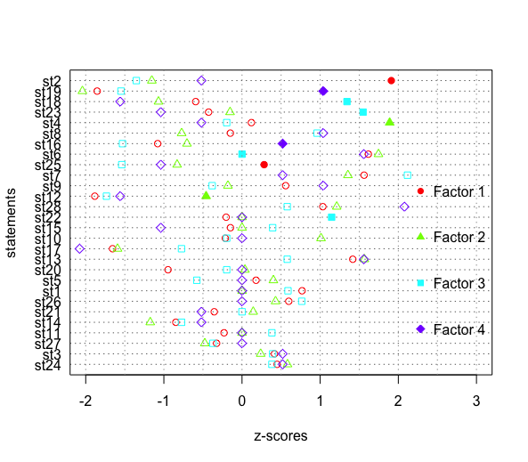

# TLabs - Q-Methodology

Arguments: 28 statements, 14 Q-sorts, “FALSE” forced distribution, 4 factors, 
varimax rotation, automatic flagging and Pearson correlation coefficient. 

## Relation between Q-sorts and factors

LOA-Factor loadings for Q-sorts. Indicates the relationship between each Q-sort 
and component or factor (using “varimax” rotation function).

|Q-sort 	|f1	|f2	|f3	|F4    |
|---------------|-------|-------|-------|------|
|001	|0.770	|0.230	|0.411	|0.210|
|002	|0.543	|0.397	|0.166	|-0.093|
|004	|0.130	|0.187	|0.802	|0.124|
|005	|0.189	|0.233	|0.079	|0.902|
|006	|0.240	|0.688	|0.140	|0.216|
|007	|0.776	|0.346	|0.162	|-0.025|
|008	|0.184	|0.859	|0.251	|0.067|
|009	|0.695	|0.122	|-0.294	|0.368|
|010	|0.684	|0.301	|0.314	|0.313|
|015	|0.394	|0.747	|0.145	|0.359|
|016	|0.727	|0.126	|0.327	|0.347|
|017	|0.144	|0.210	|0.858	|-0.056|
|018	|0.751	|0.126	|-0.065	|0.452|
|019	|0.706	|0.478	|0.184	|-0.100|

NOTE: Bold numbers (>0.5) are the Q-sorts (rows) related with that factor (columns).

## Plot. Statements comparing Z-scores by the 4 factors. 

 Statements with largest consensus (bottom): 3, 27, 24, 21, 11, 14, 1 and 26. 
 
 Z-score values that are distinguishing for a given statement and factor are represented with a filled symbol.
 
 

## Q-statements

 - Land use and property rights:
 
   1.- All Mexican homes should have the right to use their land for the benefit of their children.
   
   2.- The land use of chinampas should be exclusively for agriculture.
   
   9.- The main cause for the chinampas urbanization is the lack of public policies implementation.
   
   17.- It is possible to convert the land use of chinampas to urban without degrading Xochimilco lake. 
   
 - Patrimony, identity, value:
 
   3.- The chinampas are the patrimony of Xochimilco families.
   
   4.- The chinampa represents the patrimony of all Mexicans.
   
   6.- The chinampa is an important element of the Xochimilco identity.
   
   10.- Xochimilco festivities should be preserved as they are part of Mexico’s history.
   
   20.- People who live in Xochimilco value the importance of the lake area as an ecological and cultural patrimony.
   
   11.- Xochimilco ancentral stories are still told (e.g. “La Llorona”).
   
   12.- Xochimilco as a priority site for biodiversity conservation is overrated.
   
   21.- The festivities are important for the chinampas activities.
   
   22.- The chinampa producers are still devoted to their Saints. 
   
   23.- It is important to bless the chinampas and their agricultural products. 
   
   26.- People in general have no idea of the benefits of Xochimilco and how to preserve it. 
   
   25.- People who are not native to Xochimilco are problematic because they do not know anything about it or do not care.  
 
 - Ecological conditions and stressors:
 
   7.- Urbanization is destroying Xochimilco. 
   
   14.- The trajineras boats and tourism is the main cause of degradation of the Xochimilco lake. 
   
   18.- The agricultural use of the chinampas is affecting the ecology of the Xochimilco lake.
   
   19.- The lake area of Xochimilco is in a good ecological condition.
   
   13.- Biodiversity conservation is important to preserve Xochimilco. 
   
   15.- The trajineras boats are important to preserve Xochimilco. 
   
   27.- It is a municipality obligation to maintain the Xochimilco canals in a good condition (cleaning and uncloging them).
   
   28.- All inhabitants and visitors of Xochimilco must keep the area clean. 
   
 - Livelihoods:
   
   5.- The chinampas are important for the subsistence of Xochimilco families. 
   
   8.- People build their houses on the chinampas because they do not have other alternatives for living.
   
   16.- Lots of young people aspire to continue the traditional agricultural practices in the chinampas. 
   
   24.- The sons of chinampa producers are looking for different jobs.

(Developed by Patricia Pérez-Belmont)
