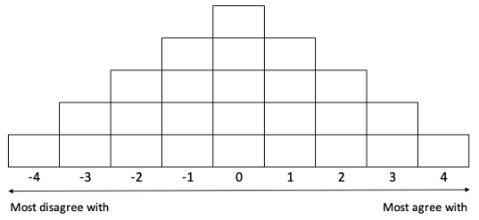
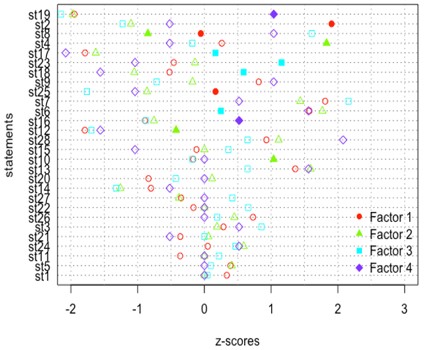
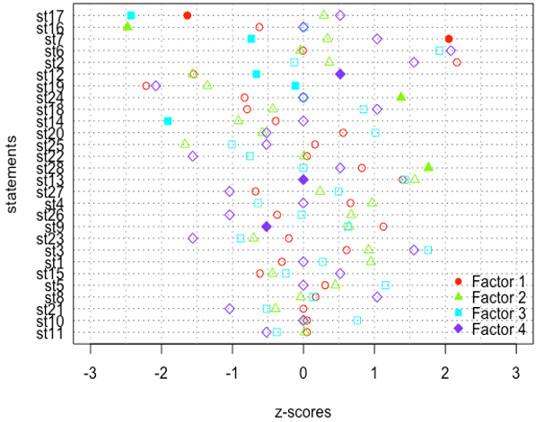

# Q-Methodology analysis for T-Lab

## Methodological annex

Q-Methodology is used to analyze subjective perspectives of a diverse group of participants regarding a particular issue (Webler et al. 2009; Zabala 2014). For this study, Q-Methodology was used as a complementary method to understand the conceptualization of the problem space and the system of values from the T-Lab participants that were later translated into narratives. This methodology is based on analyzing the consensus and disagreements among a group of diverse actors with respect to a series of statements related to a particular issue. These statements are sorted by each participant by ranking them in a range from the statements that a participant most agree with (max. value +4) to the ones that a participant most disagree with (max. value -4), leaving in the middle the statements with a neutral opinion. The statements are placed in a pyramid shape as shown in the figure below.

 
For this study, we used 28 statements based on 4 themes related to the case study of the Xochimilco urban wetland: property rights, identity and values, pressures in the ecosystem, and livelihoods. The statements are listed below:

_Land use and property rights:_

1.- All Mexican homes should have the right to use their land for the benefit of their children.

2.- The land use of chinampas should be exclusively for agriculture.

9.- The main cause for the chinampas urbanization is the lack of public policies implementation.

17.- It is possible to convert the land use of chinampas to urban without degrading the Xochimilco lake.

_Patrimony, identity, value:_

3.- The chinampas are the patrimony of Xochimilco families.

4.- The chinampa represents the patrimony of all Mexicans.

6.- The chinampa is an important element of the Xochimilco identity.

10.- Xochimilco festivities should be preserved as they are part of Mexico’s history.

11.- Xochimilco ancentral stories are still told (e.g. “La Llorona”).

12.- Xochimilco as a priority site for biodiversity conservation is overrated.

20.- People who live in Xochimilco value the importance of the lake area as an ecological and cultural patrimony.

21.- The festivities are important for the chinampas activities.

22.- The chinampa producers are still devoted to their Saints.

23.- It is important to bless the chinampas and their agricultural products.

25.- People who are not native to Xochimilco are problematic because they do not know anything about it or do not care.

26.- People in general have no idea of the benefits of Xochimilco and how to preserve it.

_Ecological conditions and stressors:_

7.- Urbanization is destroying Xochimilco.

13.- Biodiversity conservation is important to preserve Xochimilco.

14.- The trajineras boats for tourism is the main cause of the Xochimilco lake degradation.

15.- The trajineras boats are important to preserve Xochimilco.

18.- The agricultural use of the chinampas is affecting the ecology of the Xochimilco lake.

19.- The lake area of Xochimilco is in a good ecological condition.

27.- It is a municipality obligation to maintain the Xochimilco canals in a good condition (cleaning and uncloging them).

28.- All inhabitants and visitors of Xochimilco must keep the area clean.

_Livelihoods:_

5.- The chinampas are important for the subsistence of Xochimilco families.

8.- People build their houses on the chinampas because they do not have other alternatives for living.

16.- Lots of young people aspire to continue the traditional agricultural practices in the chinampas.

24.- The sons of chinampa producers are looking for different jobs.

The Q-Methodology was applied to the 13 participants in two moments, T0 for the baseline narratives, and T1 for the potential change in narratives. All participants Q-sorts, were statistically analyzed with the software RStudio version 1.0.136 (R Core Team 2016) using the qmethod package for R (Zabala 2014). Statistical Q-analysis is based in a factor analysis to find clusters of shared visions or perspectives of an issue by looking for individual patterns in each Q-sort, and using the analytical principle of correlation between individuals to find engagement or disengagement on a statement (Zabala 2014). The analysis reduces the perspectives in factors, a set of new parameters that represent an idealized Q-sort that summarizes the perspectives of the group (Webler et al. 2009). The number of factors depends on the number of Q-statements and Q-sorts, ideally the study must have a 3:1 ratio, respectively. In our case, the numbers did not match the suggested ratio, however, the Q-methodology researchers agreed to have a tolerance for the number of Q-statements and Q-sorts (Webler et al. 2009). For our analysis, we used 4 factors whose configurations of statements were later interpreted as meta-narratives.

References:
-	R Core Team (2020). R: A language and environment for statistical computing. R Foundation for Statistical Computing, Vienna, Austria. https://www.R-project.org/
-	Webler T, Danielson S, Tuler S (2009) Using Q Method to Reveal Social Perspectives in Environmental Research. Soc Environ Res 01301:1–54
-	Zabala A (2014) qmethod: A Package to Explore Human Perspectives Using Q Methodology. R J 6:163–173

## Results annex

### Results of Q-Methodology T0

Arguments for the statistical Q-analysis T0: 28 statements, 15 Q-sorts, “FALSE” forced distribution, 4 factors, varimax rotation, automatic flagging and Pearson correlation coefficient.

***Table 1. Q-sort factor loadings for Q-methodology T0.***

_Factor loadings for Q-sorts indicates the relationship between each Q-sort and component or factor. Factors result in the meta-narratives described below. Italic numbers (>0.5) are the Q-sorts (rows) associated with that factor (columns)._

|Participants	 |Factor 1	 |Factor 2	 |Factor 3	 |Factor 4  |
|---------------|-------|-------|-------|------|
|Ac-01 	|_0.789_	|0.226	|0.400	 |0.178 |
|Ch-02 	|_0.544_	|0.463	|0.095	 |-0.167|
|Ngo-04 |0.196	|0.242	|_0.715_	 |-0.015|
|Cs-05	 |0.268	|0.243	|0.016	 |_0.797_ |
|Ac-06	 |0.247	|_0.677_	|0.132	 |0.231 |
|Ch-07 	|_0.741_	|0.303	|0.223	 |0.055 |
|Co-08 	|0.177	|_0.852_	|0.254	 |0.101 |
|Ch-09 	|_0.723_	|0.182	|-0.398 |0.257 |
|Ch-10 	|_0.707_	|0.299	|0.296	 |0.278 |
|Cs-14	 |0.012	|0.049	|_0.782_	 |0.408 |
|Gov-15 |0.374	|_0.700_	|0.232	 |0.442 |
|Cs-16 	|_0.757_	|0.125	|0.308	 |0.298 |
|Cs-17 	|0.207	|0.255	|_0.758_	 |-0.179|
|Ngo-18 |_0.749_	|0.086	|-0.022	|0.483 |
|Ac-19 	|_0.705_	|0.506	|0.121	 |-0.131|

***Figure 1. Q-methodology T0 plot. Statements comparing Z-scores by the 4 factors.***

_Statements with largest consensus (bottom): 1, 5, 11, 24, 21, 3 and 26. Z-score values that distinguish a given statement and factor are represented with a filled symbol._
 
 

***Table 2. Summarized statements scores per factor considering all q-sorts from T0.***

|Statement |Factor 1 score 	    |Factor 2 score 	    |Factor 3 score 	    |Factor 4 score 
|---------------|-------|-------|-------|-------|
|st1	 |1	|0	|0	|0|
|st2	 |4	|-2	|-2	|1|
|st3	 |1	|1	|2	|1|
|st4	 |0	|4	|-1	|-1|
|st5	 |1	|1	|0	|0|
|st6	 |3	|3	|0	|3|
|st7	 |3	|2	|4	|1|
|st8	 |0	|-1	|3	|2|
|st9	 |2	|0	|-1	|2|
|st10	|0	|2	|-1	|0|
|st11	|-1	|0	|0	|0|
|st12	|-3	|-1	|-3	|-3|
|st13	|2	|3	|1	|3|
|st14	|-2	|-3	|-2	|-1|
|st15	|0	|0	|0	|-2|
|st16	|-2	|-1	|-2	|1|
|st17	|-3	|-3	|0	|-4|
|st18	|-1	|-2	|1	|-3|
|st19	|-4	|-4	|-4	|2|
|st20	|-2	|0	|-1	|0|
|st21	|-1	|0	|0	|-1|
|st22	|0	|0	|2	|0|
|st23	|-1	|0	|3	|-2|
|st24	|0	|1	|1	|1|
|st25	|0	|-2	|-3	|-2|
|st26	|1	|1	|0	|0|
|st27	|0	|-1	|1	|0|
|st28	|2	|2	|1	|4|

### Meta-narratives from Q-methodology in T0 or Qa

***Agriculture viability (factor 1).*** This meta-narrative expresses that agriculture needs to be viable, and urbanization is the main source of degradation. This group perception is that the chinampas are the most important element of Xochimilco´s identity, hence, the main activity should be agriculture. This group considers that urbanization is one of the main drivers for the changes in the ecological conditions of the wetland and that it is not possible to think of an urbanization that does not affect the wetland in a negative way. Also, this group perception on Xochimilco outsiders is that they do not know or do not care enough about the conservation of the wetland and thus, they do not see it as a priority.

Positives (+4, +3, +3)

2. The land use of chinampas should be exclusively for agriculture.

6. The chinampa is an important element of the Xochimilco identity.

7. Urbanization is destroying Xochimilco.

Negatives (-4, -3, -3)

19. The lake area of Xochimilco is in a good ecological condition.

12. Xochimilco as a priority site for biodiversity conservation is overrated.

17. It is possible to convert the land use of chinampas to urban without degrading Xochimilco lake.

Distinctive 

2. (+4) The land use of chinampas should be exclusively for agriculture.

25. (0) People who are not native to Xochimilco are problematic because they do not know anything about it or do not care.  

***Heritage relevance (factor 2).*** This meta-narrative shows strong influence of agriculture as tradition, identity and cultural value. This perspective is oriented on the importance of Xochimilco wetland as part of the Mexican patrimony and identity mainly because of the value of the chinampa itself and the biodiversity. For that reason, Xochimilco should be preserved through the maintenance of its history, festivities and biodiversity conservation, and by avoiding urbanization.

Positives (+4, +3, +3)

4. The chinampa represents the patrimony of all Mexicans.

6. The chinampa is an important element of the Xochimilco identity.

13. Biodiversity conservation is important to preserve Xochimilco. 

Negatives (-4, -3, -3)

19. The lake area of Xochimilco is in a good ecological condition.

14. The trajineras boats and tourism is the main cause of degradation of the Xochimilco lake. 

17. It is possible to convert the land use of chinampas to urban without degrading Xochimilco lake.

Distinctive

4. (+4) The chinampa represents the patrimony of all Mexicans.

10. (+2) To me, Xochimilco festivities should be preserved, as they are part of Mexico’s history.

12. (-1) Xochimilco as a priority site for biodiversity conservation is overrated.

***Urban and agricultural balance (factor 3).*** Xochimilco is degraded by urbanization but also by poor agricultural practices. And although it has a high value as a biodiversity conservation site, actors represented by this narrative understand that people sometimes have no alternative other than to live in their lands or chinampas (which leads to urbanization). Unlike the other meta-narratives, this one disagrees with the idea that there are no external people that value Xochimilco, which coincides with the profiles of the actors that belong to this narrative, since they are external to Xochimilco but with profound attachment and activism in the area. Another aspect that distinguishes this narrative is that participants consider that the spiritual value of chinampas and agriculture is important.

Positives (+4, +3, +3)

7. Urbanization is destroying Xochimilco. 

8. People built their houses on the chinampas because they do not have other alternatives for living.

23. It is important to bless the chinampas and their agricultural products. 

Negatives (-4, -3, -3)

19. The lake area of Xochimilco is in a good ecological condition.

12. Xochimilco as a priority site for biodiversity conservation is overrated.

25. People who are not native to Xochimilco are problematic because they do not know anything about it or do not care.  

Distinctive

23. (+3) It is important to bless the chinampas and their agricultural products. 

18. (+1) The agricultural use of the chinampas is affecting the ecology of the Xochimilco lake.

6. (0) The chinampa is an important element of the Xochimilco identity.

17. (0) It is possible to convert the land use of chinampas to urban without degrading Xochimilco lake.

***Wetland resilience (factor 4).*** This meta-narrative is distinguishable from the other meta-narratives because from this perspective, the Xochimilco wetland still maintains ecological functions that make it resilient, so despite the presence of agricultural activities, these do not completely disturb the ecology of the wetland. For this meta-narrative, inhabitants, users and visitors should preserve its agricultural vocation as part of people’s identity, and the biodiversity of the area. 

Positives (+4, +3, +3)

28. All inhabitants and visitors of Xochimilco must keep the area clean. 

6. The chinampa is an important element of the Xochimilco identity.

13. Biodiversity conservation is important to preserved Xochimilco. 

Negatives (-4, -3, -3)

17. It is possible to convert the land use of chinampas to urban without degrading Xochimilco lake.

12. Xochimilco as a priority site for biodiversity conservation is overrated.

18. The agricultural use of the chinampas is affecting the ecology of the Xochimilco lake.

Distinctive

16. (+1) Lots of young people aspire to continue the traditional agricultural practices in the chinampas. 

19. (+2) The lake area of Xochimilco is in a good ecological condition.

### Results of Q-Methodology T1

Arguments for the statistical Q-analysis T1: 28 statements, 13 Q-sorts, “FALSE” forced distribution, 4 factors, varimax rotation, automatic flagging and Pearson correlation coefficient. For Q-methodology T1 we were not able to gather the q-sorts corresponding to participants Ch-02 and Ch-09, thus we reported in the article the results for the 13 participants with data for T0 and T1.

***Table 3. Q-sort factor loadings for Q-methodology T1.***

_Factor loadings for Q-sorts indicates the relationship between each Q-sort and component or factor. Factors result in the meta-narratives described below. Italic numbers (>0.5) are the Q-sorts (rows) or participants associated with that factor (columns)._

|Participant	|Factor 1	|Factor 2	|Factor 3	|Factor 4
|---------------|-------|-------|-------|-------|
|Ac-01 	|_0.689_	|0.177	|0.383	|0.344|
|Ch-02 	|-	|-	|-	|-|
|Ngo-04 |0.373	|0.420	|_0.636_	|0.054|
|Cs-05	|0.316	|-0.057	|_0.651_	|0.020|
|Ac-06	|-0.094	|0.127	|_0.853_	|0.144|
|Ch-07 |_0.495_	|0.241	|0.270	|0.106|
|Co-08 	|0.380	|_0.496_	|0.407	|0.152|
|Ch-09 	|-	|-	|-	|-|
|Ch-10 	|0.227	|0.096	|0.119	|_0.866_|
|Cs-14	|-0.041	|_0.727_	|0.151	|0.498|
|Gov-15 	|0.431	|_0.545_	|0.377	|0.255|
|Cs-16 	|0.280	|_0.688_	|0.068	|0.107|
|Cs-17 	|0.269	|_0.734_	|-0.037	|-0.405|
|Ngo-18 	|_0.883_	|0.191	|-0.134	|0.149|
|Ac-19 	|_0.772_	|0.230	|0.273	|-0.099|

***Figure 2. Q-methodology T1 plot. Statements comparing Z-scores by the 4 factors.***

_Statements with largest consensus (bottom): 11 and 10. Z-score values that distinguish a given statement and factor are represented with a filled symbol._

  

***Table 4. Summarized statements scores per factor considering all q-sorts from T1.***

|Statements |Factor 1 score 	    |Factor 2 score 	    |Factor 3 score 	    |Factor 4 score 
|---------------|-------|-------|-------|-------|
|st1	|0	|2	|1	|0|
|st2	|4	|1	|0	|3|
|st3	|1	|2	|3	|3|
|st4	|2	|2	|-1	|0|
|st5	|1	|1	|2	|0|
|st6	|0	|0	|4	|4|
|st7	|3	|0	|-2	|2|
|st8	|1	|0	|0	|2|
|st9	|2	|1	|1	|-1|
|st10	|0	|0	|1	|0|
|st11	|0	|0	|-1	|-1|
|st12	|-3	|-3	|-1	|1|
|st13	|3	|3	|3	|0|
|st14	|-1	|-2	|-3	|0|
|st15	|-1	|-1	|0	|1|
|st16	|-1	|-4	|0	|0|
|st17	|-3	|0	|-4	|1|
|st18	|-2	|-1	|2	|2|
|st19	|-4	|-2	|0	|-4|
|st20	|1	|-1	|2	|1|
|st21	|0	|-1	|-1	|-2|
|st22	|0	|0	|-2	|-3|
|st23	|0	|-2	|-2	|-3|
|st24	|-2	|3	|0	|0|
|st25	|0	|-3	|-3	|-1|
|st26	|-1	|1	|0	|-2|
|st27	|-2	|0	|1	|-2|
|st28	|2	|4	|0	|1|

### Meta-narratives from Q-methodology in T1 or Qb

***Urbanization incompatible (factor 1).*** For this meta-narrative, it is necessary to stop urbanization in the area as it is not compatible with the preservation of the agro-ecological system. Thus, urbanization is causing the degradation of the wetland, hence it is not possible to conceive a situation in which the land use of chinampas can be converted to habitable areas without degrading the wetland.

Positives (+4, +3, +3)

2. The land use of chinampas should be exclusively for agriculture.

7. Urbanization is destroying Xochimilco. 

13. Biodiversity conservation is important to preserved Xochimilco. 

Negatives (-4, -3, -3)

19. The lake area of Xochimilco is in a good ecological condition.

12. Xochimilco as a priority site for biodiversity conservation is overrated.

17. It is possible to convert the land use of chinampas to urban without degrading Xochimilco lake.

Distinctive

7. (+3) Urbanization is destroying Xochimilco. 

17. (-3) It is possible to convert the land use of chinampas to urban without degrading Xochimilco lake.

***Generational shift in priorities (factor 2).*** This meta-narrative is strongly distinguished by the idea that young people like the sons of the older farmers or chinamperos are looking for job opportunities different from agriculture and they are not interested in keeping the traditional agricultural practices. In addition, this perspective considers that it is not only inhabitants responsibility, but from all users and visitors of Xochimilco to preserve the wetland. Comparing with the meta-narrative Heritage relevance, this perspective still disagrees with the idea that the outsiders are problematic or do not care, which is consistent with the actors’ profiles on this group: they are all people who work on activities different from the ones practiced on the chinampas for example, but all of them have been working strongly in the Xochimilco area.

Positives (+4, +3, +3)

28. All inhabitants and visitors of Xochimilco must keep the area clean. 

13. Biodiversity conservation is important to preserved Xochimilco. 

24. The sons of chinampa producers are looking for different works.

Negatives (-4, -3, -3)

16. Lots of young people aspire to continue the traditional agricultural practices in the chinampas. 

12. Xochimilco as a priority site for biodiversity conservation is overrated.

25. People who are not native to Xochimilco are problematic because they do not know anything about it or do not care.  

Distinctive

16. (-4) Lots of young people aspire to continue the traditional agricultural practices in the chinampas. 

28. (+4) All inhabitants and visitors of Xochimilco must keep the area clean.

24. (+3) The sons of chinampa producers are looking for different jobs.

***Urban empathy (factor 3).*** This perspective did not change a lot from Qa (Urban and agricultural balance). Nonetheless, in this version, participants disagree on tourism as the main cause of degradation, and the degree of importance of urbanization is not as representative as in other meta-narratives.

Positives (+4, +3, +3)

6. The chinampa is an important element of the Xochimilco identity.

3. The chinampas are the patrimony of Xochimilco families.

13. Biodiversity conservation is important to preserved Xochimilco. 

Negatives (-4, -3, -3)

17. It is possible to convert the land use of chinampas to urban without degrading Xochimilco lake.

14. The trajineras boats and tourism is the main cause of degradation of the Xochimilco lake. 

25. People who are not native to Xochimilco are problematic because they do not know anything about it or do not care.  

Distinctive

17. (-4) It is possible to convert the land use of chinampas to urban without degrading Xochimilco lake.

14. (-3) The trajineras boats and tourism is the main cause of degradation of the Xochimilco lake. 

7. (-2) Urbanization is destroying Xochimilco. 

12. (-1) Xochimilco as a priority site for biodiversity conservation is overrated.

19. (0) The lake area of Xochimilco is in a good ecological condition.

***Rooted identity (factor 4).*** This meta-narrative shows a rooted identity as it considers that chinampas’ agriculture has a mayor relevance for the Xochimilco families. From this perspective, it is important to consider that in order to preserve Xochimilco, it is necessary to conserve the biodiversity, but also consider the lack of efficient public policies. This perspective suggests that there is also a loss of spirituality related to agricultural practices.

Positives (+4, +3, +3)

6. The chinampa is an important element of the Xochimilco identity.

2. The land use of chinampas should be exclusively for agriculture.

3. The chinampas are the patrimony of Xochimilco families.

Negatives (-4, -3, -3)

19. The lake area of Xochimilco is in a good ecological condition.

22. The chinampa producers are still devoted to their Patron Saints. 

23. It is important to bless the chinampas and their agricultural products. 

Distinctive

9. (-1) Main cause for urbanization of chinampas is the lack of public policies implementation.

12. (+1) Xochimilco as a priority site for biodiversity conservation is overrated.

13. (0) Biodiversity conservation is important to preserve Xochimilco.

(Developed by Patricia Pérez-Belmont)
