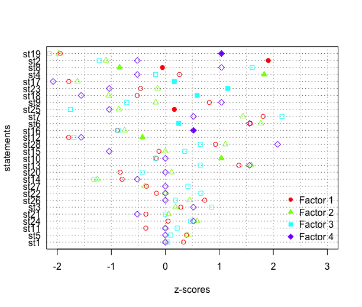

# TLabs - Q-Methodology

Arguments: 28 statements, 15 Q-sorts, “FALSE” forced distribution, 4 factors, 
varimax rotation, automatic flagging and Pearson correlation coefficient. 

## Relation between Q-sorts and factors

LOA-Factor loadings for Q-sorts. Indicates the relationship between each Q-sort 
and component or factor (using “varimax” rotation function).

|Q-sort 	|f1	|f2	|f3	|F4    |
|---------------|-------|-------|-------|------|
|001	|0.789	|0.226	|0.400	|0.178|
|002	|0.544	|0.463	|0.095	|-0.167|
|004	|0.196	|0.242	|0.715	|-0.015|
|005	|0.268	|0.243	|0.016	|0.797|
|006	|0.247	|0.677	|0.132	|0.231|
|007	|0.741	|0.303	|0.223	|0.055|
|008	|0.177	|0.852	|0.254	|0.101|
|009	|0.723	|0.182	|-0.398	|0.257|
|010	|0.707	|0.299	|0.296	|0.278|
|014 |0.012	|0.049	|0.782	|0.408|
|015 |0.374	|0.700	|0.232	|0.442|
|016 |0.757	|0.125	|0.308	|0.298|
|017 |0.207	|0.255	|0.758	|-0.179|
|018 |0.749	|0.086	|-0.022	|0.483|
|019 |0.705	|0.506	|0.121	|-0.131|

NOTE: Bold numbers (>0.5) are the Q-sorts (rows) related with that factor (columns).

## Plot. Statements comparing Z-scores by the 4 factors. 

 Statements with largest consensus (bottom): 1, 5, 11, 24, 21, 3 and 26.
 
 Z-score values that distinguish a given statement and factor are represented with a filled symbol.
 
 

## Q-statements

 - Land use and property rights:
 
   1.- All Mexican homes should have the right to use their land for the benefit of their children.
   
   2.- The land use of chinampas should be exclusively for agriculture.
   
   9.- The main cause for the chinampas urbanization is the lack of public policies implementation.
   
   17.- It is possible to convert the land use of chinampas to urban without degrading Xochimilco lake. 
   
 - Patrimony, identity, value:
 
   3.- The chinampas are the patrimony of Xochimilco families.
   
   4.- The chinampa represents the patrimony of all Mexicans.
   
   6.- The chinampa is an important element of the Xochimilco identity.
   
   10.- Xochimilco festivities should be preserved as they are part of Mexico’s history.
   
   20.- People who live in Xochimilco value the importance of the lake area as an ecological and cultural patrimony.
   
   11.- Xochimilco ancentral stories are still told (e.g. “La Llorona”).
   
   12.- Xochimilco as a priority site for biodiversity conservation is overrated.
   
   21.- The festivities are important for the chinampas activities.
   
   22.- The chinampa producers are still devoted to their Saints. 
   
   23.- It is important to bless the chinampas and their agricultural products. 
   
   26.- People in general have no idea of the benefits of Xochimilco and how to preserve it. 
   
   25.- People who are not native to Xochimilco are problematic because they do not know anything about it or do not care.  
 
 - Ecological conditions and stressors:
 
   7.- Urbanization is destroying Xochimilco. 
   
   14.- The trajineras boats and tourism is the main cause of degradation of the Xochimilco lake. 
   
   18.- The agricultural use of the chinampas is affecting the ecology of the Xochimilco lake.
   
   19.- The lake area of Xochimilco is in a good ecological condition.
   
   13.- Biodiversity conservation is important to preserve Xochimilco. 
   
   15.- The trajineras boats are important to preserve Xochimilco. 
   
   27.- It is a municipality obligation to maintain the Xochimilco canals in a good condition (cleaning and uncloging them).
   
   28.- All inhabitants and visitors of Xochimilco must keep the area clean. 
   
 - Livelihoods:
   
   5.- The chinampas are important for the subsistence of Xochimilco families. 
   
   8.- People build their houses on the chinampas because they do not have other alternatives for living.
   
   16.- Lots of young people aspire to continue the traditional agricultural practices in the chinampas. 
   
   24.- The sons of chinampa producers are looking for different jobs.

(Developed by Patricia Pérez-Belmont)
