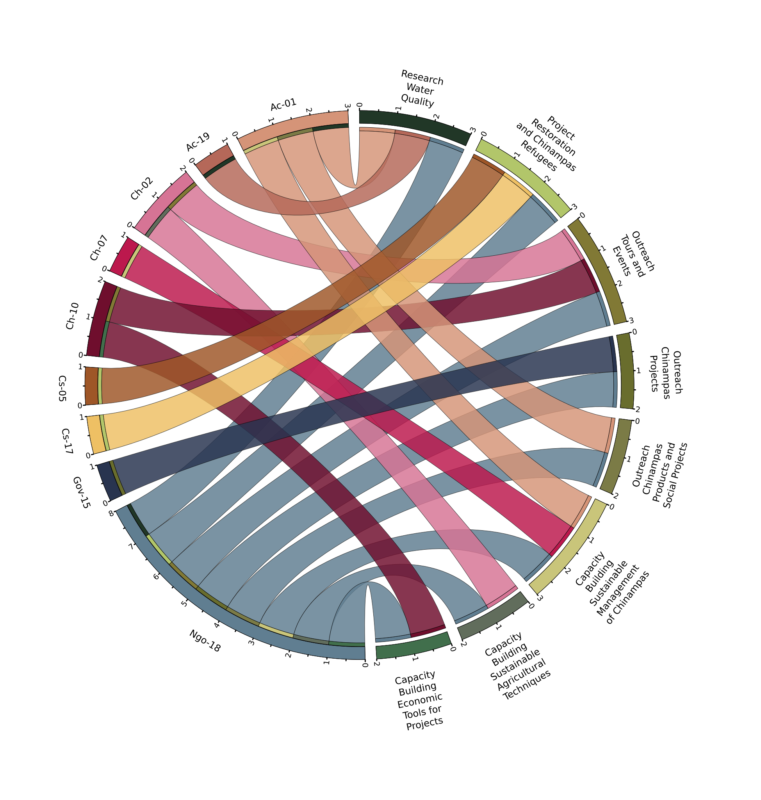
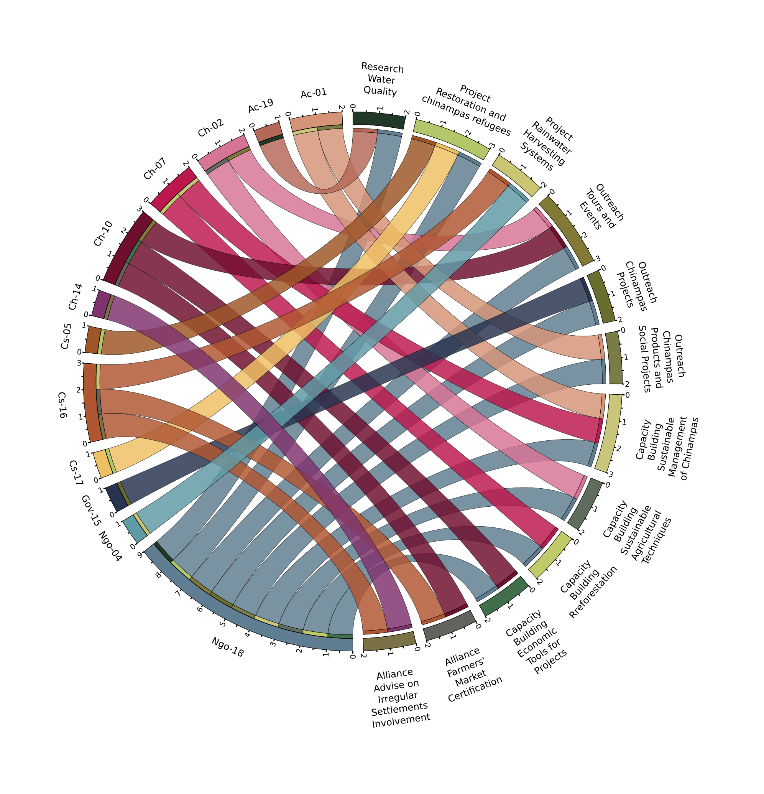
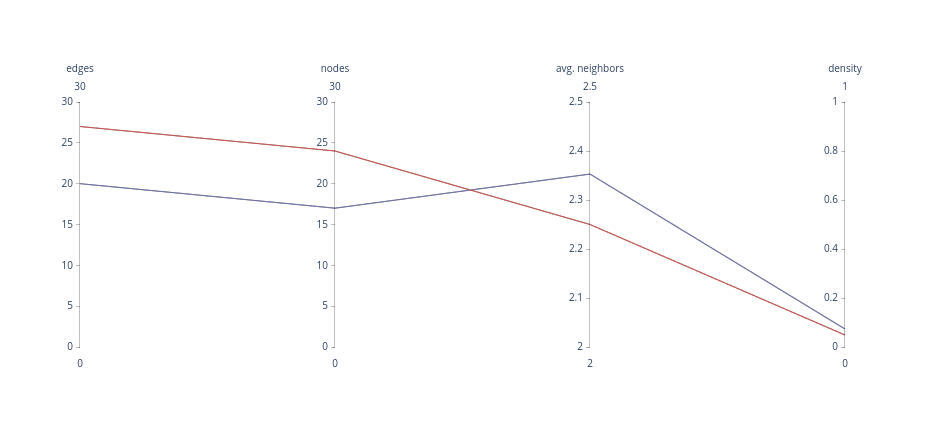
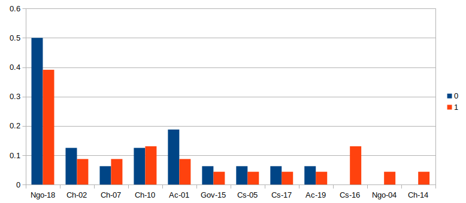

# Circos plot of Agency Network

Nodes in the network are the outmost segments among the circumference,
ribbons show connections. Green nodes represent actions, ribbons have
the color of their source node which always represents a person (there
are no green ribbons because actions are always a target) [Cs = Civil
society; Ac = Academia; Ngo = Non Governmental Organization; Ch =
Chinampero(a)/farmer; Gov = Government]. The thin inner ring, next to
the source nodes, shows segments of the same color of the node at the
other end of the connected ribbon. Ribbons in black show reported
shared actions and collaborations after the 2017 earthquake in
T1.

## Network growth

There is growth in the network from t0 to t1 which can be seen in the
increase of nodes and edges. However the average number of neighbors
decreases, which means that although there are more nodes, there
aren't many new connections. This is also why network density
decreases.

The out-degree centrality for a node is the fraction of nodes its
outgoing edges are connected to. Decrease in out-degree centrality for
some source nodes may be explained by an increase in connections.

var   || **T0**  || **T1**
nodes || 17  || 24
edges || 20  || 27
density || 0.07352941176470588 || 0.04891304347826087
avg. number of neighbors || 2.3529411764705883 || 2.25

## Generating the visualization

Data an configuration are included in this directory. They were
initially created by the [Circular Visualization of Tabular
Data](http://mkweb.bcgsc.ca/tableviewer/visualize/) which in turn was
fed the adjacency matrix of the agency network.

To generate you must install [Circos Plot](http://circos.ca/) and then run:

'''
cd circos/tdiff
/path/to/circos -conf etc/circos.conf
'''

